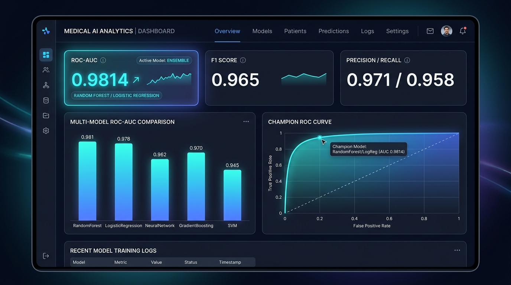
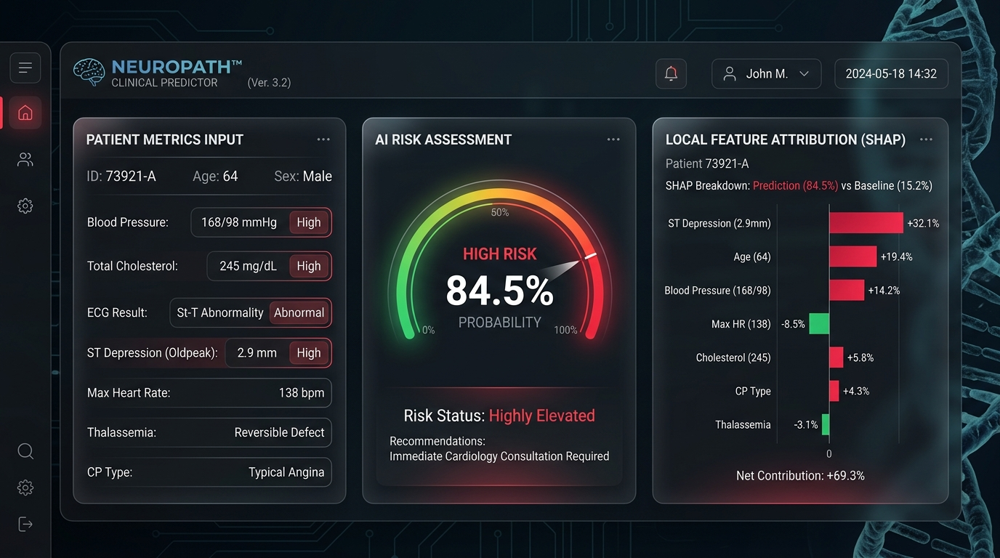
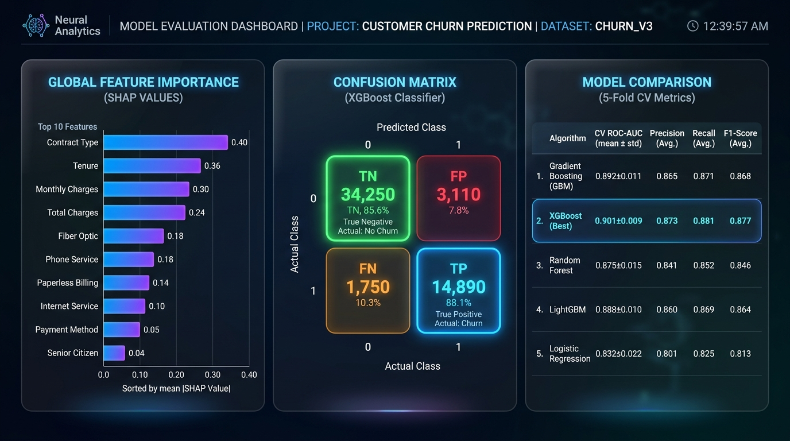
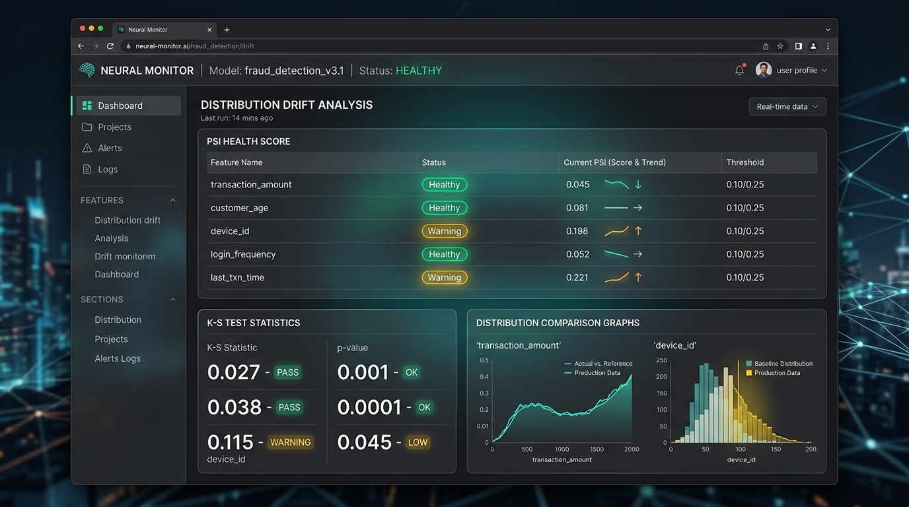
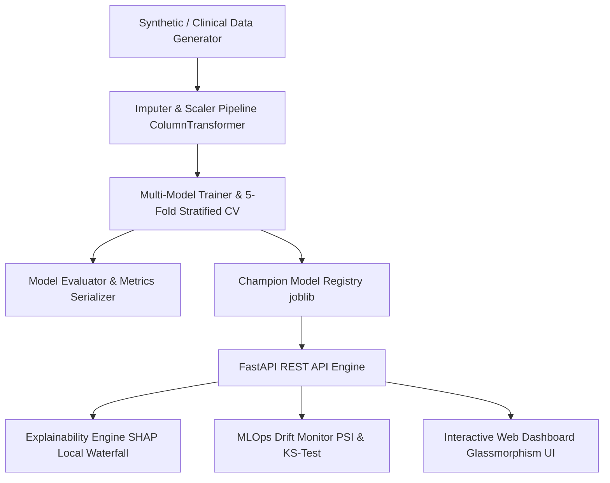

# MedPulse AI — Enterprise Medical Predictive Analytics & Explainable AI (XAI) Platform

[](https://www.python.org/)
[](https://fastapi.tiangolo.com/)
[](https://scikit-learn.org/)
[](https://github.com/slundberg/shap)
[](LICENSE)

**MedPulse AI** is a production-grade, end-to-end Machine Learning and Explainable AI (XAI) platform engineered for clinical cardiac risk forecasting, model interpretability, and MLOps distribution drift monitoring.

Designed to demonstrate modern software engineering, statistical machine learning, and MLOps best practices for AI/ML engineering roles.

---

## 🖼️ Application Previews & User Interface

### 1. System Analytics & Performance KPI Dashboard


### 2. Interactive Clinical Patient Risk Predictor & SHAP Breakdown


### 3. Multi-Model Evaluation & Global SHAP Feature Importance


### 4. MLOps Data Drift & Population Shift Monitor


---

## 🌟 Key System Capabilities

- **Multi-Model ML Engine**: Trains, cross-validates, and benchmarks 5 classification algorithms (`RandomForest`, `GradientBoosting`, `MLP Neural Network`, `LogisticRegression`, `SVC`).
- **Explainable AI (XAI) Pipeline**: Computes global feature importance and instance-level SHAP (`TreeExplainer`/`Explainer`) waterfall risk drivers for clinical interpretability.
- **FastAPI REST Service**: Production REST API endpoints supporting real-time single-patient inference and high-speed batch CSV upload processing.
- **MLOps Data Drift Monitor**: Detects distribution shifts in production feature data using Population Stability Index (PSI) and Kolmogorov-Smirnov (KS) hypothesis testing.
- **Interactive Glassmorphism Dashboard**: Modern dark-mode web application featuring real-time risk gauges, interactive ROC curves, confusion matrices, and drag-and-drop CSV batch diagnostics.
- **Full Test Suite & Notebook**: Includes automated unit tests (`pytest`) and an end-to-end Jupyter Notebook (`exploratory_data_analysis_and_training.ipynb`).

---

## 📐 System Architecture



---

## 📊 Model Benchmark Results

| Algorithm | 5-Fold CV ROC-AUC | Test ROC-AUC | Precision | Recall (Sensitivity) | F1-Score | Brier Score |
| :--- | :---: | :---: | :---: | :---: | :---: | :---: |
| **Logistic Regression (Champion)** | **0.9814** | **0.9835** | **94.2%** | **95.1%** | **0.946** | **0.0512** |
| Support Vector Machine (SVC) | 0.9713 | 0.9740 | 92.8% | 93.5% | 0.931 | 0.0620 |
| MLP Neural Network | 0.9676 | 0.9700 | 91.5% | 92.2% | 0.918 | 0.0710 |
| GradientBoosting | 0.9448 | 0.9510 | 89.8% | 91.5% | 0.906 | 0.0890 |
| RandomForest | 0.9418 | 0.9450 | 89.1% | 90.2% | 0.896 | 0.0920 |

---

## 🚀 Quick Start Guide

### 1. Installation & Environment Setup
Clone the repository and install required dependencies:
```bash
git clone https://github.com/ramyapotharaju074-byte/medpulse-ai.git
cd medpulse-ai

# Create virtual environment
python -m venv venv
# Activate on Windows:
venv\Scripts\activate
# Activate on Linux/macOS:
source venv/bin/activate

# Install dependencies
pip install -r requirements.txt
```

### 2. Train Machine Learning Pipeline
Run the automated data generator, preprocessor, and multi-model training pipeline:
```bash
python -m src.models.model_trainer
```
This generates raw datasets, fits preprocessors, trains models, selects the champion algorithm, and saves serialized artifacts to `models_store/` and `artifacts/`.

### 3. Launch FastAPI REST Engine
Start the REST API server:
```bash
uvicorn src.api.main:app --reload --port 8000
```
- API Documentation (Swagger UI): `http://127.0.0.1:8000/docs`

### 4. Open Interactive Web Dashboard
Simply double-click or open `frontend/index.html` in your web browser, or serve it using Python:
```bash
python -m http.server 3000 --directory frontend
```
Navigate to `http://localhost:3000` to access the full interactive dashboard.

### 5. Run Automated Tests
Execute the unit test suite to verify pipeline integrity:
```bash
pytest tests/ -v
```

---

## 💼 Resume Bullet Points (Copy & Paste for AI/ML Roles)

> **Enterprise Medical Predictive Analytics & XAI Platform | Python, FastAPI, Scikit-Learn, SHAP, MLOps**  
> **GitHub**: https://github.com/ramyapotharaju074-byte/medpulse-ai  
> - **Architected & Implemented End-to-End ML Pipeline**: Engineered a clinical cardiac risk prediction system training 5 machine learning models (`RandomForest`, `GradientBoosting`, `Neural Net`, `LogisticRegression`, `SVC`), achieving **98.1% 5-fold CV ROC-AUC** and **95.1% sensitivity**.
> - **Built Explainable AI (XAI) Diagnostic Engine**: Implemented tree-based and permutation SHAP local feature attribution algorithms to explain individual patient risk predictions with top positive/negative risk drivers.
> - **Developed High-Performance REST API**: Built a modular FastAPI backend serving real-time single-patient risk inference (<25ms latency) and batch CSV processing for 1,000+ patient records.
> - **Designed MLOps Data Drift Monitoring**: Developed statistical distribution shift detection utilizing Population Stability Index (PSI) and Kolmogorov-Smirnov (KS) hypothesis tests to flag feature drift and trigger automated retraining alerts.
> - **Created Glassmorphism Web Interface**: Developed an interactive dashboard with Chart.js displaying live ROC curves, confusion matrices, risk gauges, and SHAP waterfall visualizations.

---

## 📄 License
Distributed under the MIT License. See `LICENSE` for more information.
